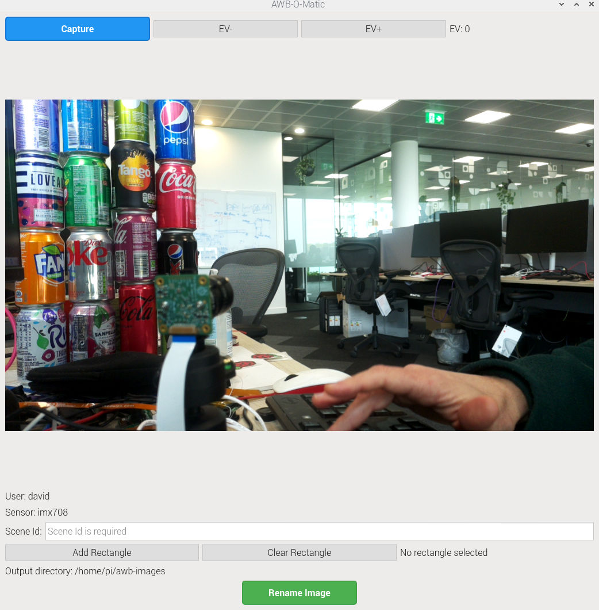

# AWB-O-Matic

AWB-O-Matic is a tool for capturing images for Auto White Balance (AWB) calibration. It allows users to capture images with a Raspberry Pi camera, select grey regions within the image, and save them for algorithm training.



## Features

- Live camera preview
- Exposure Value (EV) control
- Grey region selection with zoom and pan
- Automatic saturation checking in selected regions
- Support for both local and SSH-based operation

## Installation

The tool runs only on a Raspberry Pi, where all the required dependencies should already be available. It should be sufficient to clone this repository:
```bash
git clone https://github.com/yourusername/awb-o-matic.git
cd awb-o-matic
```

## Usage

Run the application with:
```bash
python awb-o-matic.py -u YOUR_USERNAME
```

The application will try to detect if you are connected to the Pi over ssh, and adjust its preview window accordingly. If this fails, the `--ssh` or `--no-ssh` options can be used to force the correct behaviour (see below)

### Command Line Arguments

- `-u, --user`: Set the user name for saved images (required)
- `-o, --output`: Override the output directory (default: ~/awb-images)
- `-t, --tmp`: Override the temporary directory (default: /dev/shm)
- `-s, --ssh`: Enable SSH mode
- `--no-ssh`: Disable SSH mode

### Basic Workflow

1. First, capture an image. Use the "Capture" button at the top. You can increase or decrease the exposure if necessary with the "EV-" and "EV+" buttons. The captures are saved to a temporary location.
2. Once you have captured an image, we must rename it correctly and copy it to the output folder.
   - If you need to record a grey region for the image, click the "Add Rectangle" button.
   - In the "Add Rectangle" dialog, click and drag the mouse to pan. Use the mouse wheel to zoom. And use Ctrl+Click and drag the mouse to select a rectangular region.
   - If you don't need a grey region, click "Clear Rectangle".
   - You must enter a "Scene Id" to identify this particular scene.
   - Finally click "Rename Image" to rename and copy the images to the output folder.

And return back to step 1 again for the next image.

## Output Files

Images are saved in the output directory with the following naming convention:
```
USER,SENSOR,SCENE_ID,X0,Y0,X1,Y1.jpg
USER,SENSOR,SCENE_ID,X0,Y0,X1,Y1.dng
```

If no rectangle is selected, the coordinates are omitted from the filename.

## Problems

Please discuss on the Raspberry Pi Camera Forum post.

## License

This project is licensed under the BSD Simplified 2-Clause License - see the [LICENSE](LICENSE) file for details.
